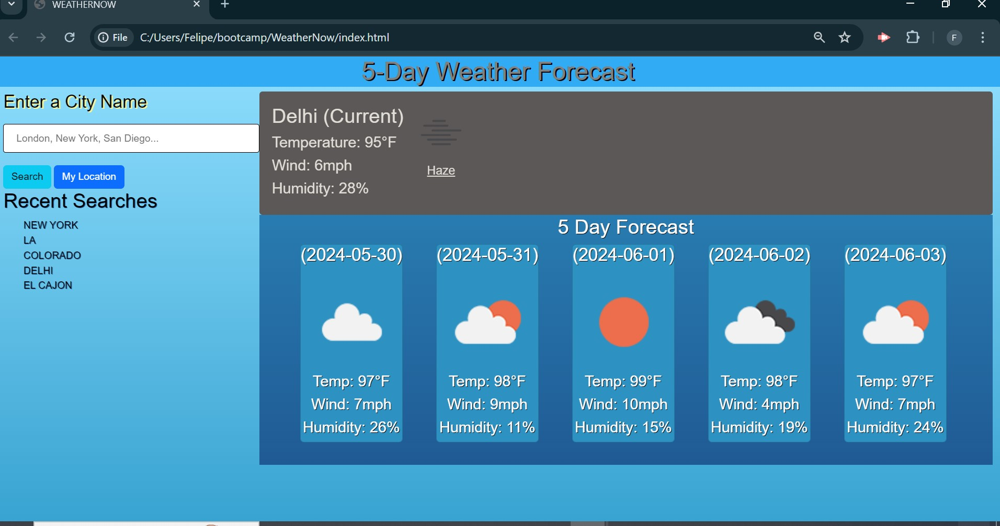

# 06 Server-Side APIs: Weather Dashboard

## User Story

```
AS A traveler
I WANT to see the weather outlook for multiple cities
SO THAT I can plan a trip accordingly
```

## Acceptance Criteria

```
GIVEN a weather dashboard with form inputs
WHEN I search for a city
THEN I am presented with current and future conditions for that city and that city is added to the search history
WHEN I view current weather conditions for that city
THEN I am presented with the city name, the date, an icon representation of weather conditions, the temperature, the humidity, and the wind speed
WHEN I view future weather conditions for that city
THEN I am presented with a 5-day forecast that displays the date, an icon representation of weather conditions, the temperature, the wind speed, and the humidity
WHEN I click on a city in the search history
THEN I am again presented with current and future conditions for that city
```

## Mock-Up

The following image shows the web application's appearance and functionality:




## Resources
* Bootstrap css framework
* Bootcamp activities and mini-projects
* openweathermap API along with Geo coding API to convert lat and longitude into data to access city forecasts

## Usage 
When you look up a city it will prompt you if the city you have enter exists or not. There will also be a prompt in case of an issue fetching the coordinates.
If there are no issues with the cities, then you can either click on search or "enter" to trigger the search. The search will then fetch the current weather and a 5 day weather forecast. Meanwhile, the city entered will also be added to the recent searches location, where you can click on them to have the city's forcast be displayed again.